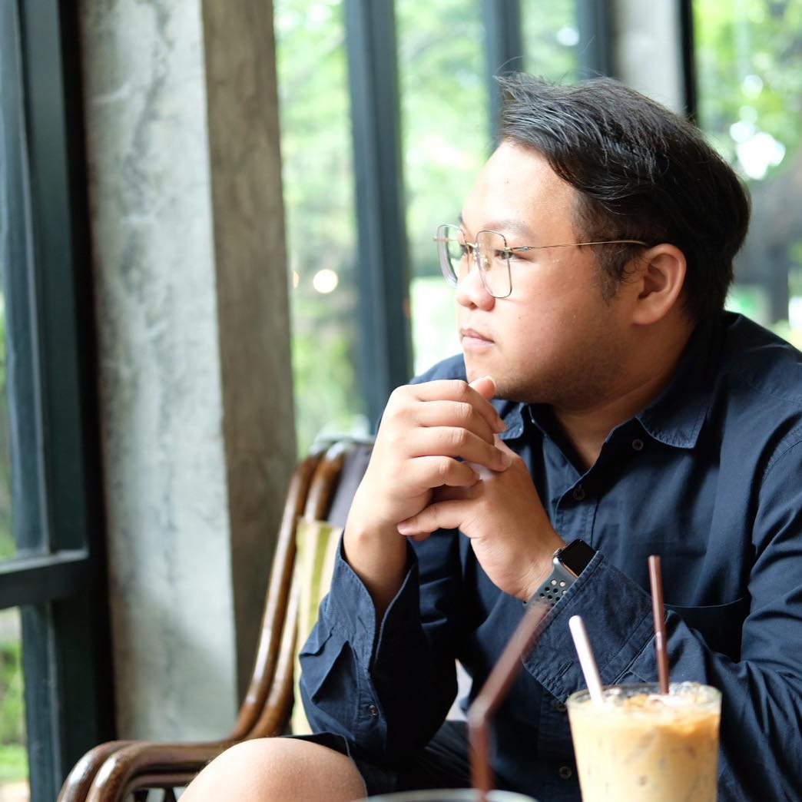

# Supakit Sujaritcheewawong  
**Software Engineer & System Analyst**  
Bangkok, Thailand 🇹🇭  
📞 +66-80-519-7333  
📧 supakit021@gmail.com
🔗 [GitHub](https://github.com/NoisKung) | [LinkedIn](https://www.linkedin.com/in/s-supakit/) | [Youtube](https://www.youtube.com/@noiscser)

---

## 🎯 Objective

Motivated and detail-oriented software engineer with 5+ years of experience designing and implementing internal tools and enterprise solutions using C#.NET. Proven ability to analyze complex systems, drive product improvements, and bridge the gap between engineering and operations. Seeking to contribute to Your mission of building innovative tools that empower people worldwide.

---

## 🌟 Key Qualifications

- **System Analysis & Architecture**: Expertise in translating business requirements into functional design. Adept at writing Use Cases, Flow Diagrams, and Technical Specs.
- **C#.NET Engineering**: Experienced in developing scalable systems using .NET 6/8, ASP.NET MVC, WPF, Web API, and LINQ.
- **Database Design**: Strong command of SQL Server and MongoDB, including query optimization and schema design.
- **Cross-functional Collaboration**: Worked directly with Japanese and Thai teams on shared codebases, support tooling, and multi-national deployments.
- **Project Leadership**: Led a 5-member IT support team, aligning development efforts with user needs and support insights.

---

## 💼 Professional Experience

### Runexy Corporation / Runexy (Thailand)  
**Software Engineer & IT Support Team Lead**  
*2018 – Present | Niigata, Japan / Bangkok, Thailand*

- Designed and developed enterprise-grade tools in C#/.NET to support internal operations and customer support processes.
- Team Developed system analysis for Log Collecting Solution (**MylogStar**) and DLP solution (**RunDX**), including requirements gathering, documentation, and technical reviews.
- Team Developed **MylogStar Desktop**, **RunDX Device Control v2.0**, a diagnostic tool for data collection with a modern WPF front end.
- Developed backend log analysis systems for alert tracing, file export monitoring, and device activity reporting.
- Coordinated cross-border feature releases, ensuring alignment between Japan-based product managers and Thailand-based engineering team.
- Team Lead of 5 member, Offshore Develop Software from Japanese and get KPI of member to Supervisor
- IT Support, Maintenance Server, Laptop and Network in Office.

**Technologies:** .NET 8, WPF, SQL Server, Entity Framework, Docker, GitHub, Azure DevOps, Figma, Windows APIs

---

## 🎞️ Video Editor

- Produced, edited, and published engaging video content for YouTube and Twitch, driving audience growth and improving viewer retention.
- Managed end-to-end video production workflow, including planning, recording, editing, and post-production using industry-standard tools (Adobe Premiere Pro, DaVinci Resolve).
- Collaborated with streamers and content creators to deliver high-quality multimedia assets tailored to target audiences.
- Analyzed channel metrics to optimize content strategy and increase engagement across platforms.
- Maintained consistent brand identity and visual style across all published media.
- Channels: [YouTube](https://www.youtube.com/@noiscser) | [Twitch](https://www.twitch.tv/noiscser)

---

## 🧠 Core Competencies

- System Thinking & Problem Solving  
- Product-driven Mindset  
- API & Data Design  
- Technical Documentation  
- Agile (Scrum) Workflows  
- Bilingual Communication (TH/JP)

---

## 🛠 Technical Stack

| Category     | Skills                                                        |
|--------------|---------------------------------------------------------------|
| Languages    | C#, SQL, TypeScript (basic), JavaScript (basic)               |
| Frameworks   | .NET 6/8, ASP.NET MVC, WPF, Web API                           |
| Databases    | SQL Server, MongoDB                                           |
| Dev Tools    | Git, Visual Studio, Docker, Azure DevOps                      |
| Design & UX  | Figma, RESTful API Design                                     |
| Languages    | Thai (native), Japanese (business), English (intermediate)    |

---

## 🎓 Education

**Bachelor of Engineering in Computer Engineering**  
Thammasat University, Thailand — *Class of 2018*

---

## 🎖 Certifications

- **Google Data Analytics**  
- **Google Advanced Data Analytics**  
- **Google Cyber Security**  
- **Google Project Management**  
- **Japanese Language Proficiency Test (JLPT N3)**

---
