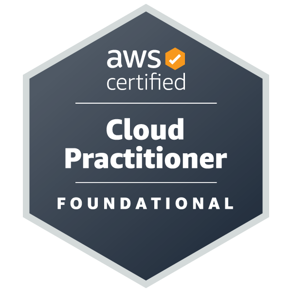

# Supakit Sujaritcheewawong  
**Software Engineer & System Analyst**  
Bangkok, Thailand 🇹🇭  
📞 +66-80-519-7333  
📧 supakit021@gmail.com
🔗 [GitHub](https://github.com/NoisKung) | [LinkedIn](https://www.linkedin.com/in/s-supakit/) | [Youtube](https://www.youtube.com/@noiscser) | [Twitch](https://www.twitch.tv/noiscser) | [Resume.md](soft_eng_and_sys_analysis.md)

---

## 🎯 Objective

Motivated and detail-oriented software engineer with 5+ years of experience designing and implementing internal tools and enterprise solutions using C#.NET. Proven ability to analyze complex systems, drive product improvements, and bridge the gap between engineering and operations. Seeking to contribute to Your mission of building innovative tools that empower people worldwide.

---

## 🌟 Key Qualifications

- **System Analysis & Architecture**: Expertise in translating business requirements into functional design. Adept at writing Use Cases, Flow Diagrams, and Technical Specs.
- **C#.NET Developer**: Experienced in developing scalable systems using .NET, ASP.NET MVC, WPF, Web API, and LINQ, build the install or deployed on cloud platforms for production-grade reliability and performance.
- **Full Stack Web Developer**: Skilled in building modern, scalable web applications using Next.js, React, and TypeScript with PostgreSQL backends, deployed on cloud platforms for production-grade reliability and performance.
- **Database Design**: Strong command of SQL Server and MongoDB, including query optimization and schema design.
- **Agile Methodologies**: Experienced in Scrum workflows, sprint planning, and iterative development cycles to deliver high-quality software on time.
- **Technical Documentation**: Proficient in writing and maintaining technical documentation for internal and external users.
- **IT Support**: Provided technical support and troubleshooting for end-users, ensuring minimal downtime and optimal system performance.
- **Project Leadership**: Led a 5-member IT support team, aligning development efforts with user needs and support insights.
- **Cross-functional Collaboration**: Worked directly with Japanese and Thai teams on shared codebases, support tooling, and multi-national deployments.
- **Business Ownership & Commercial Judgement**: Own and operate real P&L businesses — government lottery retail, a delivery-only restaurant on LINE MAN and Grab, and a self-directed investment portfolio. Comfortable reasoning about pricing, unit economics, and risk, not only about code.
- **Founder-level Product Ownership**: Took PawCRM from customer discovery to a live, paying-tier SaaS — designing the business model and the system that delivers it, and communicating both to technical and non-technical audiences.

---

## 💼 Professional Experience

### Runexy Corporation / Runexy (Thailand)  
**Software Engineer & IT Support Team Lead**  
*2018 – Present | Niigata, Japan / Bangkok, Thailand*

- Designed and developed enterprise-grade tools in C#/.NET to support internal operations and customer support processes.
- Joined system design and development for Log Collecting Solution (**MylogStar**) and DLP solution (**RunDX**), including requirements gathering, technical documentation, and architectural design.
- Architected and delivered **MylogStar Desktop** and **RunDX Device Control**, an enterprise-grade diagnostic and device control platform with advanced monitoring, remote policy management, and real-time data collection capabilities using modern WPF front end.
- Developed backend log analysis systems for alert tracing, file export monitoring, and device activity reporting with multi-tenant architecture support.
- Coordinated cross-border feature releases, ensuring alignment between Japan-based product managers and Thailand-based engineering team.

**Technologies:** .NET 10, .NET Blazor Framework, WPF, SQL Server, Entity Framework, Docker, GitHub, Azure DevOps, Figma, Windows APIs

---

## 🚀 Featured Project

### PawCRM — Veterinary Clinic Management SaaS

**Founder, Product Owner & Full Stack Engineer**  
*2026 – Present | Bangkok, Thailand | [paw.nichecrm.sbs](https://paw.nichecrm.sbs/)*

- Built and launched a multi-tenant SaaS that consolidates appointments, patient medical records, vaccination tracking, medication inventory, and billing for Thai veterinary clinics into a single platform.
- Owned the entire product cycle — problem discovery with practising Thai veterinarians, requirements and user-flow documentation, data modelling, implementation, deployment, and post-launch iteration.
- Designed the commercial model alongside the software: a four-tier freemium ladder (Free / Starter / Pro / Growth) with annual-billing discounts and locked-in early-adopter pricing, sized against clinic scale and feature depth.
- Implemented PDPA-compliant data handling using PostgreSQL Row-Level Security, audit logging, and tenant isolation, so clinic and pet-owner records stay segregated by design rather than by convention.
- Integrated the channels Thai clinics actually use — LINE Messaging API for appointment and vaccination reminders, PromptPay QR for payment, and outbound API access for automation tooling.
- Translated clinical workflow (SOAP notes, lab results, vaccine schedules, real-time stock levels) into a domain model that non-technical clinic staff can operate without training, with AI-assisted SOAP drafting on higher tiers.
- Serves as a working demonstration of both sides of the role: articulating a business model to non-engineers, and shipping the software that makes it real.

**Technologies:** Next.js, React, TypeScript, PostgreSQL, Supabase (Auth, Row-Level Security, Storage), LINE Messaging API, PromptPay, Vercel

---

## 🧾 Entrepreneurship & Ownership

### Government Lottery Retail Business — Owner / Operator

*2013 – Present | Thailand*

- Own and run a government lottery (สลากกินแบ่งรัฐบาล) retail operation end to end — capital allocation, sourcing, pricing, storefront presentation, and customer relationships.
- Carry full P&L accountability: every ticket purchased is capital at risk, so stock volume per draw is sized from observed demand rather than optimism.
- Reconcile cash, unsold stock, and prize payouts against every twice-monthly draw cycle, keeping records precise enough to settle claims and disputes without ambiguity.
- Operate inside the Government Lottery Office's regulated retail price ceiling, treating compliance as a hard constraint rather than a margin lever.
- Built repeat custom through consistency — reliable hours, honest handling of winning tickets, and a reputation customers return to twice a month.

### Online Restaurant Business (LINE MAN & Grab) — Owner / Operator

*2025 – Present | Bangkok, Thailand*

- Founded and operate a delivery-first restaurant selling exclusively through LINE MAN and Grab, with no dine-in channel to absorb weak execution.
- Own the unit economics: priced every menu item against platform commission, packaging, and ingredient cost so each order is profitable at the platform's take rate, not merely at list price.
- Manage both storefronts as products — menu structure, photography, item copy, and promotion campaigns tuned to each platform's ranking and discount mechanics.
- Run daily operations against a hard service loop: prep time drives rider wait, rider wait drives rating, and rating drives storefront visibility — so kitchen throughput is managed as a measurable system.
- Handle reviews and order defects personally, converting complaint patterns into changes to recipes, packaging, and prep sequencing.

### Personal Investment Portfolio — Mutual Funds & Technology Equities

*2020 – Present*

- Manage a self-directed portfolio of mutual funds and listed technology companies, funded with own capital and accountable for every decision in it.
- Research each position before committing — business model, revenue quality, competitive position, and the specific conditions that would prove the thesis wrong.
- Size positions and diversify deliberately, holding to a written risk limit instead of reacting to short-term market noise.
- Review decisions against outcomes on a fixed cadence and record what was actually wrong, so mistakes become inputs to the next decision rather than sunk cost.
- Follow the technology sector closely enough to connect engineering trends to commercial outcomes — the same lens applied to product and architecture decisions at work.

---

## 🎞️ Video Editor

- Produced, edited, and published engaging video content for YouTube and Twitch, driving audience growth and improving viewer retention.
- Managed end-to-end video production workflow, including planning, recording, editing, and post-production using industry-standard tools (Adobe Premiere Pro, DaVinci Resolve).
- Collaborated with streamers and content creators to deliver high-quality multimedia assets tailored to target audiences.
- Analyzed channel metrics to optimize content strategy and increase engagement across platforms.
- Maintained consistent brand identity and visual style across all published media.
- Channels: [YouTube](https://www.youtube.com/@noiscser) | [Twitch](https://www.twitch.tv/noiscser)

---

## 🧠 Core Competencies

- System Thinking & Problem Solving  
- Product-driven Mindset  
- API & Data Design  
- Technical Documentation  
- Agile (Scrum) Workflows  
- Bilingual Communication (TH/JP)
- Ownership & End-to-End Accountability
- Business Model & Unit Economics
- Risk Assessment & Decision Review

---

## 🛠 Technical Stack

| Category                 | Skills                                                        |
|--------------------------|---------------------------------------------------------------|
| Languages                | C#, SQL, TypeScript (basic), JavaScript (basic)               |
| Frameworks               | .NET 10, ASP.NET MVC, WPF, Web API, .NET Blazor                  |
| Cloud Platforms Skill    | Azure, AWS, Google Cloud                                      |
| Modern Web Development   | Full Stack Next.js, React, TypeScript                         |
| Databases                | SQL Server, MongoDB, PostgreSQL                               |
| Dev Tools                | Git, Visual Studio, Docker, Azure DevOps, AWS DevOps          |
| Design & UX              | Figma, RESTful API Design                                     |
| Languages                | Thai (native), Japanese (business), English (intermediate)    |

---

## 🎓 Education

**Bachelor of Engineering in Computer Engineering**  
Thammasat University, Thailand — *Class of 2018*

---

## 🎖 Certifications

- **AWS Certified Cloud Practitioner**
- **Google Data Analytics** ([Coursera](https://coursera.org/share/68ad11764de13f036b7945a3bbfd6097) | [PDF](pdf/Coursera%209G9QENJGCC9Y.pdf))
- **Google Advanced Data Analytics** ([Coursera](https://coursera.org/share/db8b83931d9051c38cadae9b885fbdf9) | [PDF](pdf/Coursera%20BDJFAPK9R6JF.pdf))
- **Google Cybersecurity** ([Coursera](https://coursera.org/share/1e7c99e3059887896a6ec9eb46c1a501) | [PDF](pdf/Coursera%20NEKX26VN9LZU.pdf))
- **Google Project Management** ([Coursera](https://coursera.org/share/650959e4018f4d79a71b702b0007f956) | [PDF](pdf/Coursera%20Q8V35HGW8RSP.pdf))
- **Japanese Language Proficiency Test (JLPT N3)**

  

---
